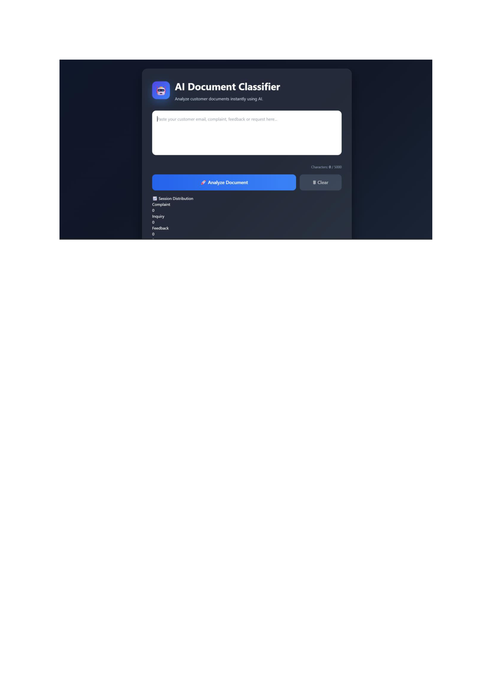

# 🤖 AI Document Classifier

An AI-powered web application that automatically classifies customer documents into predefined categories using an intelligent AI workflow built with **n8n** and **Ollama (Llama 3.2)**.

The application provides a modern React interface where users can paste or upload customer documents and receive:

- 📂 Document Category
- 🎯 Confidence Score
- 💡 AI-generated Reason

---

## 🚀 Features

- 🤖 AI-powered document classification
- 📄 Customer document analysis
- 🎯 Confidence score prediction
- 💡 AI-generated explanation
- 📂 Drag & Drop TXT file upload
- ⚡ Real-time classification
- 🎨 Modern responsive UI
- 🧩 Modular React components
- 🔗 n8n workflow automation
- 🦙 Local LLM using Ollama (Llama 3.2)

---

## 📸 Preview



---

## 🏗 Project Architecture

```
React Frontend
      │
      ▼
Express Backend API
      │
      ▼
n8n Workflow
      │
      ▼
Ollama (Llama 3.2)
      │
      ▼
AI Response
      │
      ▼
React UI
```

---

## 🛠 Tech Stack

### Frontend

- React
- Vite
- JavaScript
- CSS3

### Backend

- Node.js
- Express.js

### AI

- Ollama
- Llama 3.2

### Workflow Automation

- n8n

---

## 📂 Project Structure

```
AI-DOCUMENT-CLASSIFIER

frontend/
│
├── src/
│   ├── components/
│   │   ├── Header.jsx
│   │   ├── TextInput.jsx
│   │   ├── ActionButtons.jsx
│   │   ├── ResultCard.jsx
│   │   ├── ConfidenceBar.jsx
│   │   ├── CategoryBadge.jsx
│   │   ├── LoadingSpinner.jsx
│   │   └── FileUpload.jsx
│   │
│   ├── App.jsx
│   ├── styles.css
│   └── main.jsx
│
backend/
│
├── server.js
├── .env
└── package.json
```

---

## ⚙ Installation

### Clone Repository

```bash
git clone https://github.com/rattaneshguleria/AI-DOCUMENT-CLASSIFIER.git
```

### Install Frontend

```bash
cd frontend
npm install
npm run dev
```

### Install Backend

```bash
cd backend
npm install
node server.js
```

### Start Ollama

```bash
ollama serve
```

Run the model:

```bash
ollama run llama3.2
```

### Start n8n

```bash
npx n8n
```

---

## 🔄 Workflow

1. User enters a customer document.
2. React sends the document to the backend.
3. Backend forwards it to n8n.
4. n8n classifies the document.
5. Ollama generates confidence and reasoning.
6. Response is returned to the frontend.

---

## 📂 Supported Categories

- Complaint
- Inquiry
- Feedback
- Request
- Appreciation
- Other

---

## 🎯 Sample Output

```json
{
  "category": "Complaint",
  "confidence": 97,
  "reason": "Customer reports a service issue."
}
```

---

## 🔮 Future Improvements

- PDF Support
- DOCX Support
- OCR Image Classification
- User Authentication
- Dashboard Analytics
- Classification History
- Dark Mode
- Export Results
- Docker Deployment
- Cloud AI Model Support

---

## 👨‍💻 Author

**Rattanesh Guleria**

GitHub:

https://github.com/rattaneshguleria

---

## ⭐ Support

If you like this project, consider giving it a ⭐ on GitHub.