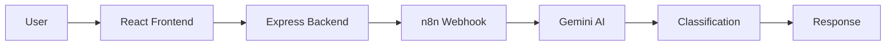

# 🤖 AI Document Classifier

<div align="center">

# 🤖 AI Document Classifier

### Intelligent Document Classification using React, Node.js, n8n & Gemini AI


Analyze → Classify → Automate

</div>

---

## 📖 Overview

AI Document Classifier is a full-stack application that classifies user-submitted text into predefined categories using an AI workflow. The frontend is built with React, the backend uses Node.js/Express, and classification is handled through an n8n workflow connected to a large language model.

---

## ✨ Features

- 📄 AI document classification
- 🤖 Gemini AI integration (or compatible LLM)
- ⚛️ React frontend
- 🚀 Node.js + Express backend
- 🔄 n8n workflow automation
- 📊 Classification confidence display
- 🕒 Request history
- 🌐 REST API

---

## 🏗️ System Architecture



---

## 🔄 Workflow

1. User enters text.
2. React sends request to Express.
3. Express forwards the request to an n8n webhook.
4. n8n invokes the AI model.
5. The AI returns the document category.
6. Results are displayed in the UI.

---

## 🧰 Tech Stack

| Layer | Technology |
|-------|------------|
| Frontend | React |
| Backend | Node.js + Express |
| AI | Gemini API / Compatible LLM |
| Workflow | n8n |
| API | REST |
| Deployment | Docker / Render / Vercel (optional) |

---

## 📂 Suggested Project Structure

```text
AI-DOCUMENT-CLASSIFIER/
├── frontend/
├── backend/
├── workflow/
├── assets/
│   ├── banner.png
│   ├── architecture.png
│   ├── workflow.png
│   └── screenshots/
├── README.md
└── docker-compose.yml
```

---

## 📸 Screenshots

Add screenshots here:

- Home Page
- Classification Result
- Analytics
- n8n Workflow
- API Response

---

## ⚙️ Installation

```bash
git clone https://github.com/rattaneshguleria/AI-DOCUMENT-CLASSIFIER.git
cd AI-DOCUMENT-CLASSIFIER
```

Install frontend:

```bash
cd frontend
npm install
npm start
```

Install backend:

```bash
cd backend
npm install
npm run dev
```

---

## 🔑 Environment Variables

Example:

```env
PORT=5000
N8N_WEBHOOK=YOUR_WEBHOOK_URL
GEMINI_API_KEY=YOUR_API_KEY
```

---

## 🚀 API

### POST /classify

Request

```json
{
  "text": "My internet has not been working for two days."
}
```

Response

```json
{
  "category":"Complaint",
  "confidence":0.98
}
```

---

## 🛣️ Roadmap

- PDF upload
- DOCX support
- OCR integration
- Batch classification
- User authentication
- Dashboard analytics
- Multi-language support

---

## 🤝 Contributing

1. Fork the repository
2. Create a feature branch
3. Commit your changes
4. Open a Pull Request

---

## 📜 License

MIT License

---

## 👨‍💻 Developer

**Rattanesh Guleria**

B.Tech Computer Science Engineering  
Lovely Professional University

GitHub: https://github.com/rattaneshguleria

---

<div align="center">

### ⭐ If you found this project useful, please consider starring the repository!

</div>
